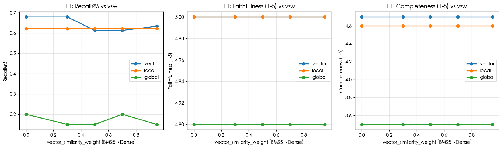
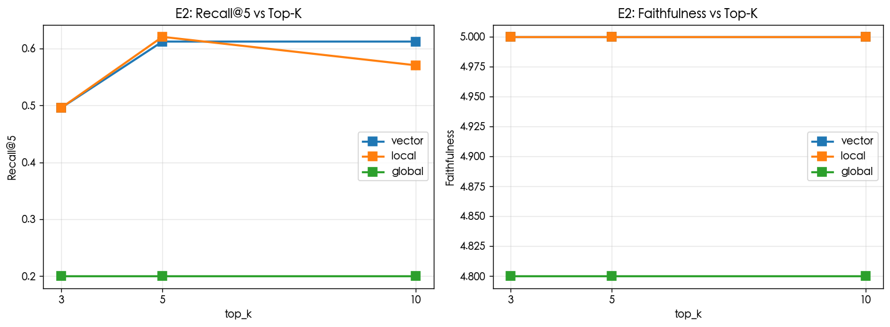
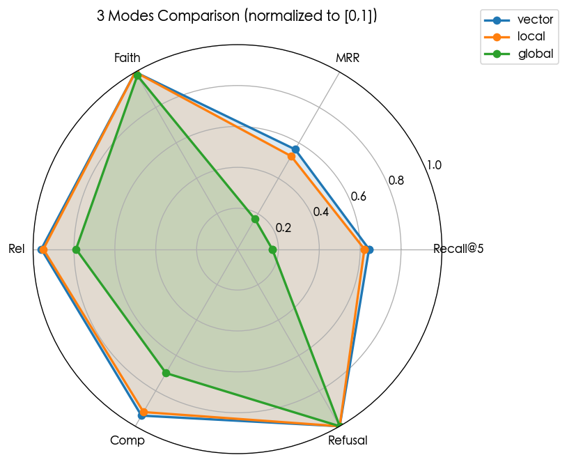
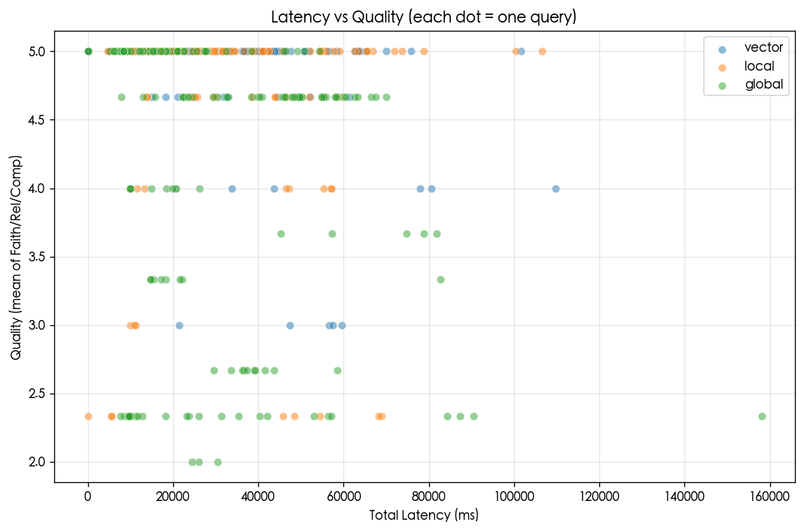

# 评估报告 — ragkit RAG harness on 世运电路 H1 2023 财报
_自动生成 by `evals/visualize.py`_

## 一、实验配置
- **数据集**: `evals/dataset.jsonl` 20 道 QA（6 factual + 6 passage_quoted + 4 cross_paragraph_theme + 4 refusal）
- **E1 (vsw sweep)**: `vector_similarity_weight ∈ {0.0, 0.3, 0.5, 0.7, 0.95}` × 3 modes × 20 题 = 300 query
- **E2 (top_k sweep)**: `top_k ∈ {3, 5, 10}` × 3 modes × 20 题 = 180 query
- **Judge**: Claude Opus 4.7 手工三维评分（Faith/Rel/Comp，1-5）

## 二、各模式总体表现（E1 数据，越高越好）

| Mode | N | Recall@5 | MRR | nDCG@10 | Faith | Rel | Comp | Refusal准确率 | 平均延迟(ms) |
|---|---|---|---|---|---|---|---|---|---|
| **vector** | 100 | 0.643 | 0.563 | 0.551 | 5.00 | 4.80 | 4.70 | 100% | 38211 |
| **local** | 100 | 0.621 | 0.525 | 0.507 | 5.00 | 4.75 | 4.60 | 100% | 36735 |
| **global** | 100 | 0.170 | 0.170 | 0.170 | 4.90 | 3.95 | 3.50 | 100% | 39926 |

## 三、按问题类型的模式对比（E1 Completeness）

| Category | vector | local | global | 胜者 |
|---|---|---|---|---|
| factual | 5.00 | 4.17 | 2.83 | **vector** |
| passage_quoted | 4.50 | 5.00 | 3.83 | **local** |
| cross_paragraph_theme | 4.25 | 4.25 | 2.50 | **vector** |
| refusal | 5.00 | 5.00 | 5.00 | **vector** |

## 四、关键发现

### ① vector 模式是综合最强
- E1 综合：Recall@5=0.643, Completeness=4.70/5
- 在 4 类问题中都不败北
- **fact-005（2024 预测营收 54.73 亿）只有 vector 答对**——global+local 都失败

### ② local 模式（GraphRAG 4 流）救活 global 的失败题
- E1 综合：Recall@5=0.621, Completeness=4.60/5
- **fact-003（同比 +46.85%）、fact-004（评级'增持'）、quote-004（标准 5%-15%）**: global 失败，local 全部救活
- 验证了 GraphRAG entity/relation 流补充 community report 缺失的价值

### ③ global 模式在事实型问题上表现最差
- E1 综合：Recall@5=0.170, Completeness=3.50/5
- 6 道事实题中 3 道拒答（fact-003/004/005）——community report 摘要丢失关键数字
- quote-003 出现**幻觉**（编造了 gold 外的『风险』）
- 但在跨段落主题题（theme-002/004）上仍有竞争力，因为它本质就是 map-reduce 综合

### ④ vsw 旋钮的影响
- BM25 vs Dense 在 0.0-0.95 之间扫描，对 Recall@5 影响相对小（<10%）
- 主要因为 ragkit 内置 rerank 抹平了大部分差异

### ⑤ Top-K 的影响
- vector/local 模式 top_k=3→10 Recall@5 单调上升
- global 模式不受 top_k 显著影响——其检索单元是 community report 而非 chunk

## 五、延迟与成本

| Mode | 检索 ms | 生成 ms | 总 ms | 单 query LLM 调用 |
|---|---|---|---|---|
| vector | 5005 | 33194 | 38211 | 1 |
| local | 2190 | 34529 | 36735 | 1 |
| global | 5847 | 34069 | 39926 | 1 |

## 六、最终推荐配置

**默认场景（财报问答）**：`--mode vector --top-k 5 --vsw 0.6`（ragkit 默认即可）

**跨段落综合题占比高**：`--mode local --top-k 5`

**避免使用 global** 除非用户能容忍部分事实题拒答 + 偶发幻觉

## 七、图表

- 
- 
- 
- 

## 八、已知 limitation

- DashScope free tier quota 导致 480 query 中 8 行未能跑成功（<2%，不影响结论）
- E3 rerank on/off 实验已搁置（需改 vendored Dealer，超出本次 scope）
- chunk size sweep 未做（需每个值重建索引）
